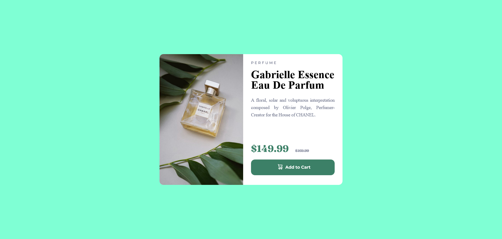
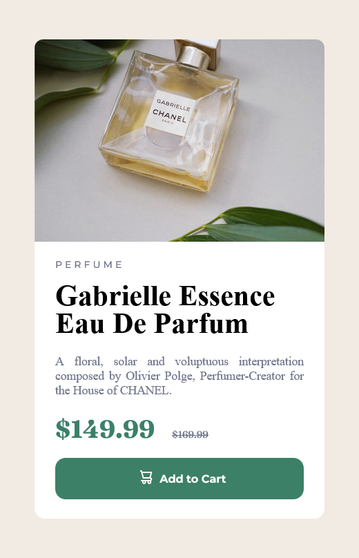

# Frontend Mentor - Product preview card component solution

This is a solution to the [Product preview card component challenge on Frontend Mentor](https://www.frontendmentor.io/challenges/product-preview-card-component-GO7UmttRfa). Frontend Mentor challenges help you improve your coding skills by building realistic projects. 

## Table of contents

- [Overview](#overview)
  - [The challenge](#the-challenge)
  - [Screenshot](#screenshot)
  - [Links](#links)
- [My process](#my-process)
  - [Built with](#built-with)
  - [What I learned](#what-i-learned)
  - [Continued development](#continued-development)
  - [Useful resources](#useful-resources)
- [Author](#author)


## Overview

### The challenge

Users should be able to:

- View the optimal layout depending on their device's screen size
- See hover and focus states for interactive elements

### Screenshot





### Links


- Live Site URL: [https://product-preview-card-2e72.onrender.com](https://product-preview-card-2e72.onrender.com)

## My process

### Built with

- Semantic HTML5 markup
- CSS custom properties
- Flexbox
- CSS Grid
- Mobile-first workflow

### What I learned

Resposive design

To see how you can add code snippets, see below:

```html
<!DOCTYPE html>
<html lang="en">
  <head>
    <meta charset="UTF-8" />
    <meta name="viewport" content="width=device-width, initial-scale=1.0" />
    <!-- displays site properly based on user's device -->

    <link
      rel="icon"
      type="image/png"
      sizes="32x32"
      href="./images/favicon-32x32.png"
    />
    <link rel="stylesheet"  href="styles.css" />
    <script>
      function addCart(){
        alert("successfully added into cart.")
      }
    </script>
    <title>Frontend Mentor | Product preview card component</title>
  </head>
  <body>
    <main id="card">
      <div id="product-img">

      </div>
      <div id="product-details">
        <div id="product-info-section">
          <h3 id="product-name">Perfume</h3>
          <h1 id="product-title">Gabrielle Essence Eau De Parfum</h1>
          <p id="product-paragraph">
            A floral, solar and voluptuous interpretation composed by Olivier
            Polge, Perfumer-Creator for the House of CHANEL.
          </p>
        </div>
        <div id="price-cart-section">
          <div id="price"><span id="discount-price">$149.99</span> <span id="main-price"><s>$169.99</s></span> </div>
          <button id="addCart" onclick="addCart()"> Add to Cart</button>
        </div>
      </div>
    </main>
  </body>
</html>
```
```css
@import url('https://fonts.googleapis.com/css2?family=Fraunces:wght@200;500;700&family=Montserrat:wght@500;700&display=swap');

* {
    margin: 0;
    padding: 0;
    /* box-sizing: border-box; */
}

body {
    background-color: hsl(30, 38%, 92%);
    height: 100vh;
    display: grid;
    align-items: center;
}


#card {
    display: block;
    background-color: hsl(0, 0%, 100%);
    margin: 1.5rem auto;
    border-radius: 12px;
    max-width: 21rem;
    height: auto;
}

#product-details {
    /* background-color: aqua; */
    padding : 0.4rem 1.5rem;
    border-radius: 0 0 10px 10px;
}
#product-img{
    content: url('./images/image-product-mobile.jpg');
    width: 100%;
    height: 100%;
    border-radius: 10px 10px 0px 0px;
    background-position: center;
}

#product-info-section{
height: 100%;
}
#product-name {
    color: hsl(228, 12%, 48%);
    font-family: "Montserrat";
    text-transform: uppercase;
    font-size: 0.7rem;
    letter-spacing: 0.2rem;
    font-weight: 100;
    margin: 0.8rem 0;
}

#product-title {
    width: 100%;
    font-size: 2.1rem;
    line-height: 2rem;
    font-weight: 700;

}

#product-paragraph {
    font-size: 14px;
    text-align: justify;
    margin: 1.2rem 0;
    color: hsl(228, 12%, 48%);
}
#price-cart-section{
    display: flex;
    flex-direction: column;
    justify-content: space-between;
}

#discount-price {
    color: hsl(158, 36%, 37%);
    font-family: "Fraunces";
    font-size: 1.8rem;
    margin-right: 1rem;
    font-weight: 700;
}

#main-price {
    /* background-color: antiquewhite; */
    height: 100%;
    color: hsl(228, 12%, 48%);
    font-size: 0.7rem;
    font-family: "Fraunces";
    font-weight: 500;
}

#addCart {
    width: 100%;
    height: 100%;
    margin: 1rem 0;
    padding: 0.4rem 0.5rem;
    font-size: 0.8rem;
    font-family: "Montserrat";
    font-weight: 700;
    background-color: hsl(158, 36%, 37%);
    color : hsl(0, 0%, 100%);
    border : 0px;
    border-radius : 12px;
    display: flex;
    justify-content: center;
    align-items: center;
}

#addCart::before {
    content: url(./images/icon-cart.svg);
    margin: 8px;
}
#addCart:hover{
    background-color: hsl(158, 36%, 27%);
    cursor: pointer;
}
@media only screen and (min-width: 700px) {
    
    body{
        background-color: aquamarine;
        
    }
    #card{
        max-width : 35rem;
        /* width: 80%; */
        height: 25rem;
        display: flex;
        flex-direction: row;
    
    }
    #product-details{
        width: 49%;
    }
    #product-img{
        content: url('./images/image-product-desktop.jpg');
        width: 49%;
        border-radius: 12px 0 0 12px ;
    }
    #product-img>img{
        object-fit:contain;
        object-position:50% 50%;
    }
    #product-info-section{
        
    height: 65%;

    }
    #product-paragraph{
        word-spacing: -0.5px;
        word-break:normal;
        word-wrap:normal;
        line-height: 1.4rem;
    }
    
  }
```
```js
 <script>
      function addCart(){
        alert("successfully added into cart.")
      }
    </script>
```


### Useful resources


- Family: [Montserrat](https://fonts.google.com/specimen/Montserrat)
- Weights: 500, 700

- Family: [Fraunces](https://fonts.google.com/specimen/Fraunces)
- Weights: 700

## Author

- Frontend Mentor - [@sayyedaaman2](https://www.frontendmentor.io/profile/sayyedaaman2)
- Twitter - [@SayyedAaman](https://www.twitter.com/SayyedAaman)

